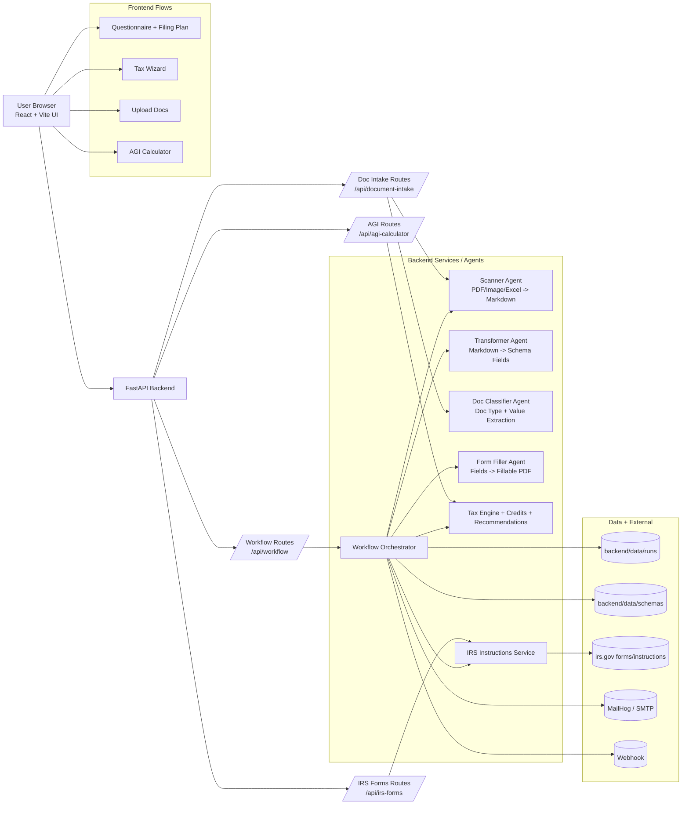
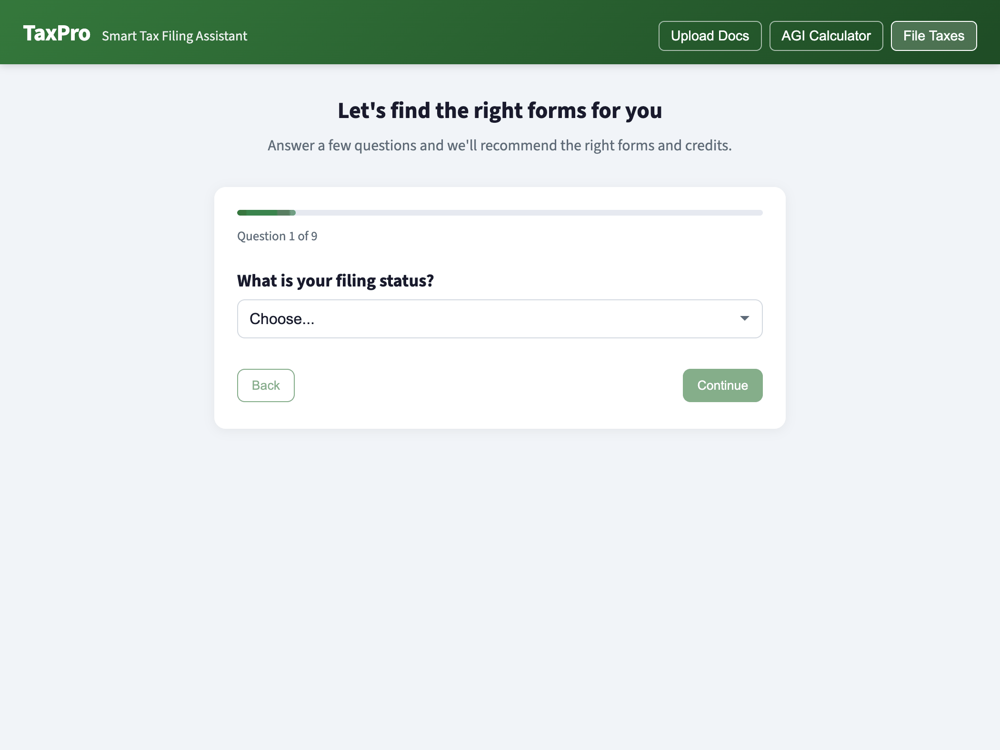
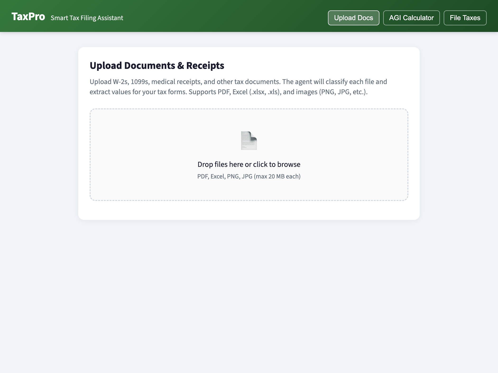
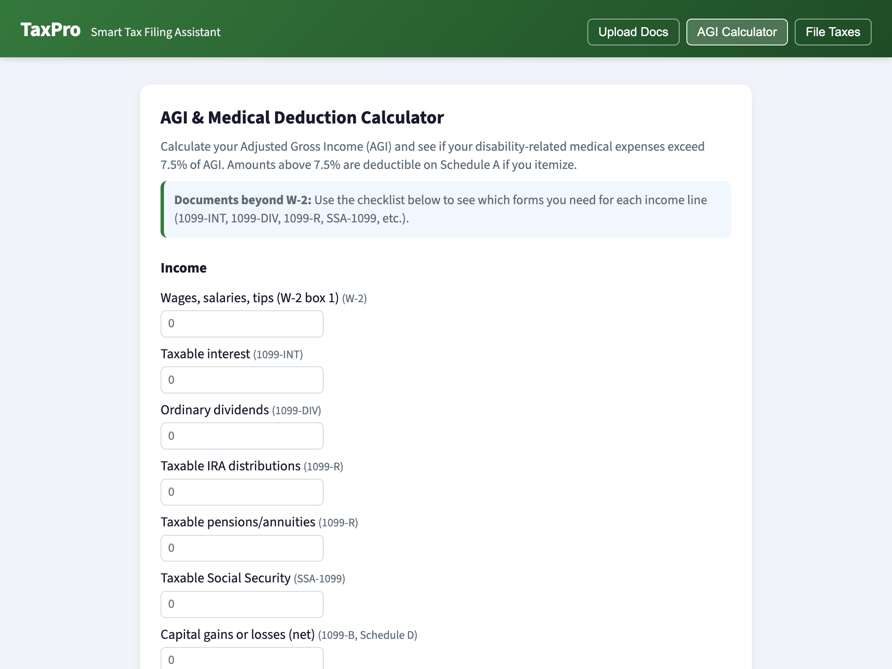
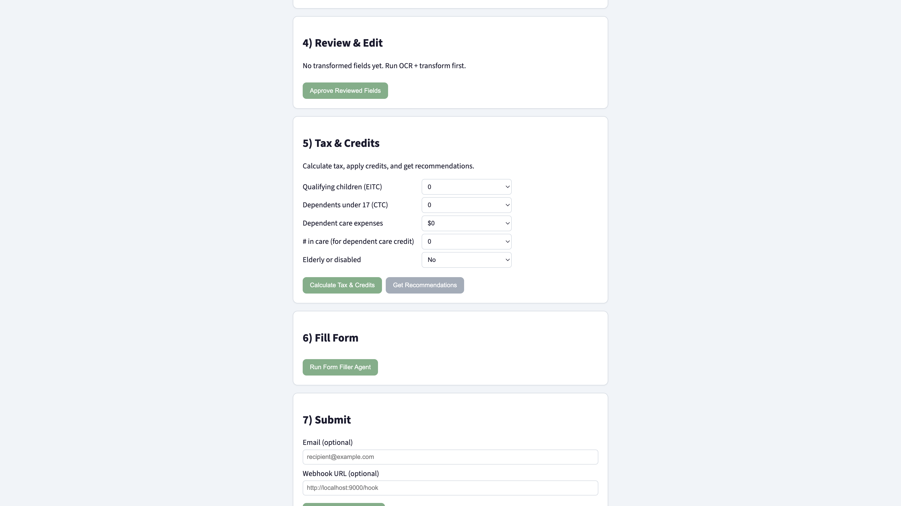
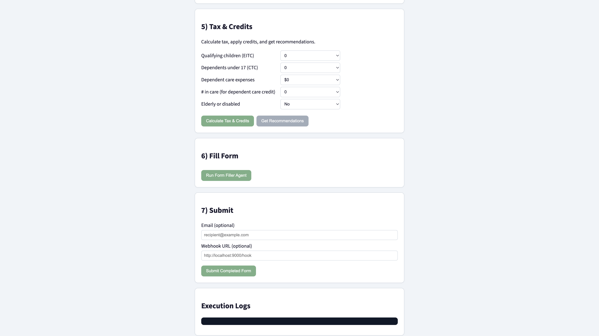

# TaxPro: Multi-Agent Tax Filing App

Local-first tax workflow app with OCR, schema-based extraction, IRS guidance integration, AGI/medical deduction calculator, and document-intake classification for tax docs/receipts.

> This software is for automation/testing workflows and is **not tax advice**.

## Features

- End-to-end filing workflow: upload -> scan -> transform -> review -> tax/credits -> fill -> submit
- IRS forms integration (download latest forms directly from irs.gov)
- Questionnaire-driven filing plan (recommended forms and workflow)
- AGI calculator with 7.5% medical floor analysis (Schedule A use case)
- Document intake agent:
  - bulk upload PDFs, images, and Excel files
  - classify docs (W-2, 1099 variants, receipts, etc.)
  - extract values and merge totals for downstream use
- Local delivery options: email (SMTP/MailHog) and webhook

## Tech Stack

- Backend: FastAPI (Python 3.12)
- Frontend: React + Vite + TypeScript
- OCR/Text extraction:
  - `pypdf` (PDF text layer)
  - `pdf2image` + `pytesseract` + `tesseract-ocr` (OCR fallback)
  - `Pillow` (images)
  - `openpyxl` (Excel parsing)
- Deployment: Docker Compose
- Local email testing: MailHog

## Repository Structure

- `backend/app/main.py` - FastAPI app and router registration
- `backend/app/api/routes/` - API routes:
  - `workflow.py` (run-based filing pipeline)
  - `irs_forms.py` (IRS form list/download)
  - `agi_calculator.py` (AGI + medical threshold calculator)
  - `document_intake.py` (bulk doc classification/extraction)
- `backend/app/services/`
  - `orchestrator.py` (workflow execution)
  - `tax_engine.py`, `credits.py`, `recommendations.py`
  - `agents/scanner.py`, `agents/transformer.py`, `agents/filler.py`, `agents/document_classifier.py`
- `backend/data/schemas/` - schema definitions (`w9.yaml`, `form1040.yaml`, `schedule-a.yaml`)
- `frontend/src/pages/WizardPage.tsx` - primary filing wizard
- `frontend/src/components/` - questionnaire, AGI calculator, document intake, review editor

## Architecture Diagram



## Screenshots / GIFs

> Add media files under `docs/assets/` and these will render in GitHub automatically.

### Main UI flows

#### 1) Questionnaire -> Filing Plan


#### 2) Upload Docs (bulk intake + classification)


#### 3) AGI Calculator (7.5% medical threshold)


#### 4) Wizard: Review -> Tax & Credits -> Fill


#### 5) Completed PDF download


### Suggested capture checklist

- Capture at `1366x768` or `1440x900` for consistency
- Keep one flow per GIF (10-25 seconds ideal)
- Blur/redact SSN, addresses, and account numbers before committing
- Prefer anonymized sample data for repo media

## Quick Start (Docker)

### 1) Start services

```bash
docker compose up --build -d
```

### 2) Open apps

- Frontend UI: `http://localhost:5173`
- Backend API docs: `http://localhost:8000/docs`
- MailHog (local inbox): `http://localhost:8025`

### 3) Stop services

```bash
docker compose down
```

## Main User Flows

### A) Filing workflow (wizard)

1. Answer questionnaire (recommended forms/workflow)
2. Review filing plan
3. Upload identity + choose IRS form (or upload your own fillable PDF)
4. Scan/OCR source docs
5. Load IRS instructions (as needed)
6. Transform extracted text into schema fields
7. Human review/edit
8. Calculate tax + credits + recommendations
9. Fill PDF
10. Submit via email/webhook (optional)
11. Download completed PDF

### B) Upload Docs (bulk intake)

Use **Upload Docs** in the header to:

- Upload up to 50 files (20MB each)
- Supported: `.pdf`, `.png`, `.jpg`, `.jpeg`, `.gif`, `.webp`, `.xlsx`, `.xls`
- Classify and extract values per document
- Merge extracted values (for AGI prefill/testing workflows)

### C) AGI calculator

Use **AGI Calculator** to:

- Enter or prefill income + adjustment values
- Compute AGI
- Check whether medical expenses exceed 7.5% of AGI
- Estimate deductible medical amount for itemized filing
- View required docs beyond W-2 (1099-INT, 1099-DIV, 1099-R, SSA-1099, etc.)

## API Overview

### Workflow API (`/api/workflow`)

- `POST /runs`
- `POST /runs/{run_id}/scan`
- `POST /runs/{run_id}/instructions`
- `POST /runs/{run_id}/transform`
- `PUT /runs/{run_id}/review`
- `POST /runs/{run_id}/tax/calculate`
- `GET /runs/{run_id}/recommendations`
- `POST /runs/{run_id}/fill`
- `POST /runs/{run_id}/submit`
- `GET /runs/{run_id}`
- `GET /runs/{run_id}/download`

### IRS forms (`/api/irs-forms`)

- `GET /list`
- `GET /{form_id}/download`

### AGI calculator (`/api/agi-calculator`)

- `POST /calculate`

### Document intake (`/api/document-intake`)

- `POST /process`

## Example API Calls

### Create workflow run (upload identity + uploaded tax form)

```bash
curl -X POST \
  -F "identity_document=@/path/to/identity.pdf" \
  -F "tax_form=@/path/to/fillable_form.pdf" \
  -F "schema_name=form1040.yaml" \
  http://localhost:8000/api/workflow/runs
```

### Create workflow run (use IRS-hosted form)

```bash
curl -X POST \
  -F "identity_document=@/path/to/identity.pdf" \
  -F "irs_form_id=f1040" \
  -F "schema_name=form1040.yaml" \
  http://localhost:8000/api/workflow/runs
```

### Process multiple docs/receipts

```bash
curl -X POST \
  -F "files=@/path/to/w2.pdf" \
  -F "files=@/path/to/1099-int.pdf" \
  -F "files=@/path/to/medical-receipt.jpg" \
  http://localhost:8000/api/document-intake/process
```

### Calculate AGI + medical 7.5% threshold

```bash
curl -X POST http://localhost:8000/api/agi-calculator/calculate \
  -H "Content-Type: application/json" \
  -d '{
    "filing_status": "Single",
    "wages": 70000,
    "taxable_interest": 500,
    "ordinary_dividends": 200,
    "taxable_ira": 0,
    "taxable_pension": 0,
    "taxable_social_security": 0,
    "capital_gain_loss": 0,
    "sch_c_income": 0,
    "other_income": 0,
    "student_loan_interest": 1200,
    "medical_expenses": 9000,
    "medical_insurance_reimbursement": 1000
  }'
```

## Configuration

See `.env.example` and `backend/.env.example`.

Common flags:

- `APP_SMTP_ENABLED` (default `false`)
- `APP_SMTP_HOST` (default `mailhog`)
- `APP_SMTP_PORT` (default `1025`)
- `APP_SMTP_FROM`
- `APP_WEBHOOK_ENABLED` (default `false`)

For local email testing:

- set `APP_SMTP_ENABLED=true`
- restart backend container

## Known Constraints

- PDF fill step requires a fillable AcroForm PDF.
- Transformer and classifier are heuristic/rule-based; accuracy depends on document quality and naming.
- OCR quality depends on scan resolution and image clarity.
- Excel extraction reads sheet values but does not infer accounting semantics beyond pattern matching.
- This project does not replace professional tax preparation/advice.

## Development Notes

- Data is persisted under `backend/data/` (including run states and extracted markdown).
- Avoid committing real personal tax data into version control.
- For realistic validation, use anonymized copies of prior filings and source docs.
